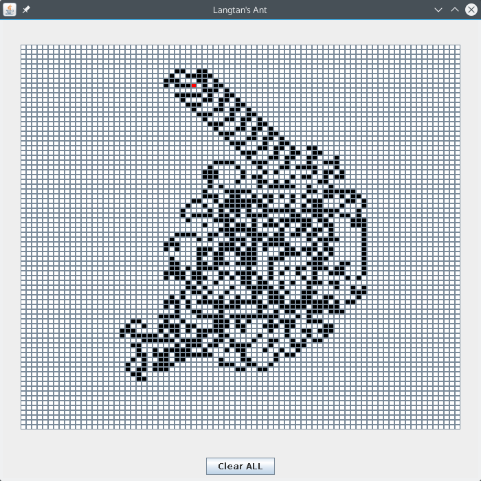

# Langton-s-Ant-Java
simulation of Langton's Ant with Java

Intro:
====
Langton's ant is a two-dimensional Turing machine with a very simple set of rules but complex emergent behavior.  
Squares on a plane are colored variously either black or white. We arbitrarily identify one square as the "ant". The ant can travel in any of the four cardinal directions at each step it takes. The ant moves according to the rules below: 
- At a white square, turn 90° right, flip the color of the square, move forward one unit 
- At a black square, turn 90° left, flip the color of the square, move forward one unit 
For details : [wikipedia](https://en.wikipedia.org/wiki/Langton%27s_ant)

Usage:
====
Compile the Main.java  
 <code>javac Main.java</code> 
Run  
 <code>java Main</code>
 
Screenshot:
====
The red gird represents the ant.

Todo:
====
- Control the ant to stop and to continue
- press a grid to add an ant
